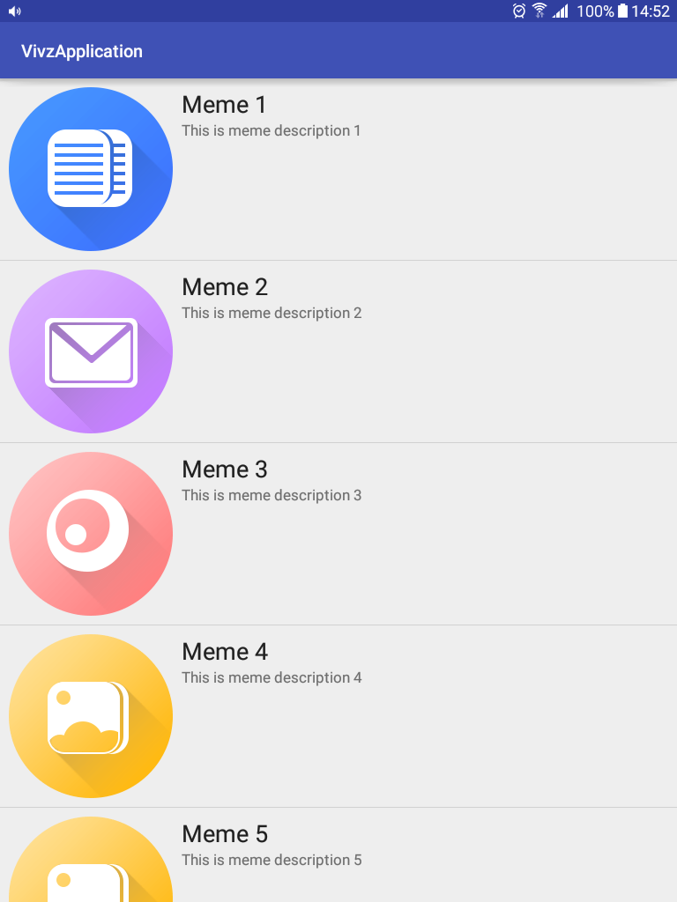
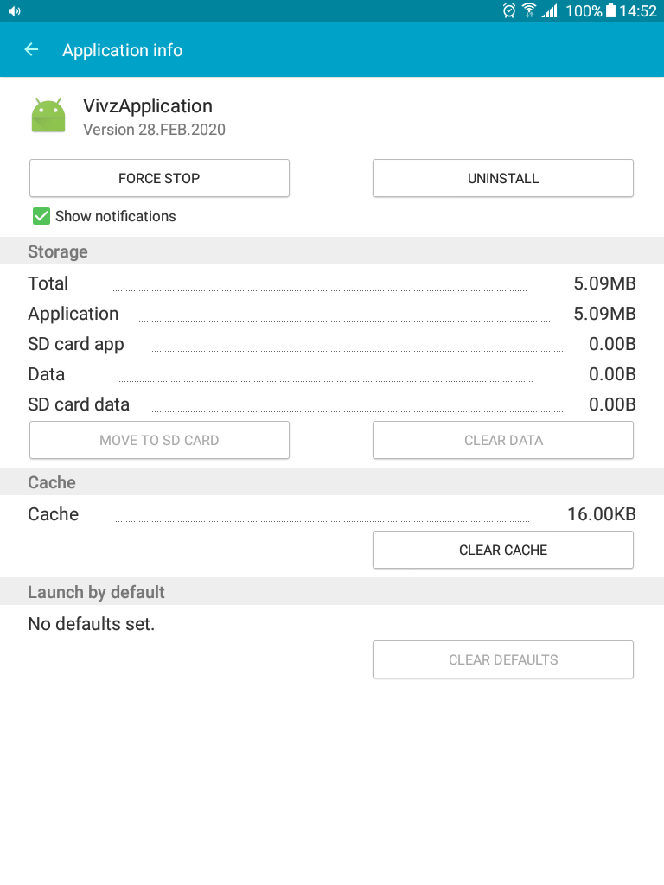

listview_with_image_using_array_adapter
=======================================

This Android Tutorial video shows how to create an Android ListView with image that uses a custom ArrayAdapter to fetch data from string-array located inside strings.xml in res folder. Use the getView method of your Custom ArrayAdapter to inflate a layout file that contains an ImageView and 2 TextViews to fill the data in and pass it back to the ListView

Create the drawable folder and add 10 images under it for this project to work. Each image preferably 48x48px and named meme1, meme2...10

